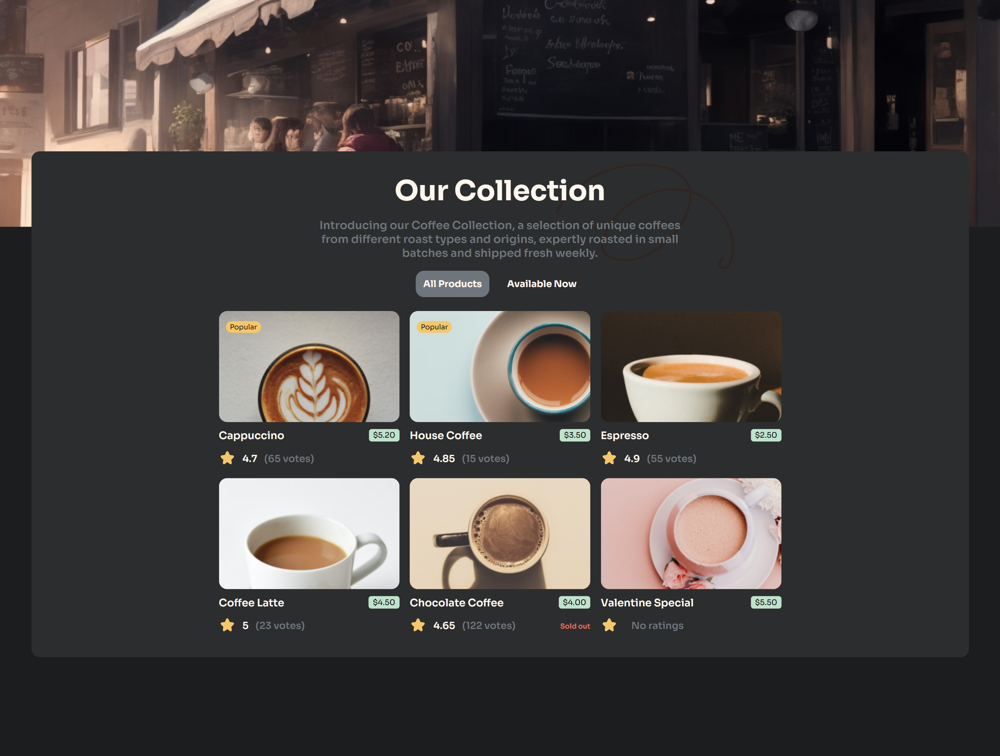

<h1 align="center">Coffee Listing App | devChallenges</h1>

   Solution for a challenge <a href="https://devchallenges.io/challenge/simple-coffee-listing" target="_blank">Simple Coffee Listing</a> from <a href="http://devchallenges.io" target="_blank">devChallenges.io</a>.

  <h3>
    <a href="https://your-demo-link.vercel.app">
      Demo
    </a>
     | 
    <a href="https://github.com/your-username/devchallenges-coffee-listing">
      Solution
    </a>
     | 
    <a href="https://devchallenges.io/challenge/simple-coffee-listing">
      Challenge
    </a>
  </h3>

## Table of Contents

- [Overview](#overview)
  - [What I learned](#what-i-learned)
  - [Useful resources](#useful-resources)
- [Built with](#built-with)
- [Features](#features)
- [Contact](#contact)
- [Acknowledgements](#acknowledgements)

## Overview

### What I learned

- Practiced responsive layout using `rem`, `media queries`, and `grid layout`
- Implemented scalable design system with CSS custom properties
- Learned how to properly load and configure Google Fonts
- Set up responsive typography using `html { font-size }`
- Used `auto-fit` and `minmax()` in CSS Grid to create a flexible card layout

### Useful resources

- [CSS Grid Guide (CSS-Tricks)](https://css-tricks.com/snippets/css/complete-guide-grid/) — Helped understand how to limit column count
- [Responsive Typography with REM](https://zellwk.com/blog/rem-vs-em/) — Great refresher on `rem` usage and 62.5% base font-size trick

### Built with

- Semantic HTML5 markup
- CSS custom properties (variables)
- Flexbox
- CSS Grid
- React
- Context API
- TS

## Features

- Coffee card list with stock status
- Responsive layout with max 3 cards per row
- Support for multiple screen sizes (including mobile)
- Minimal and clean UI design

## Acknowledgements

- [Google Fonts — Sora](https://fonts.google.com/specimen/Sora)
- [devChallenges](https://devchallenges.io/) — for the challenge and inspiration

## Author

- GitHub: [@your-username](https://github.com/PavAndrei)
